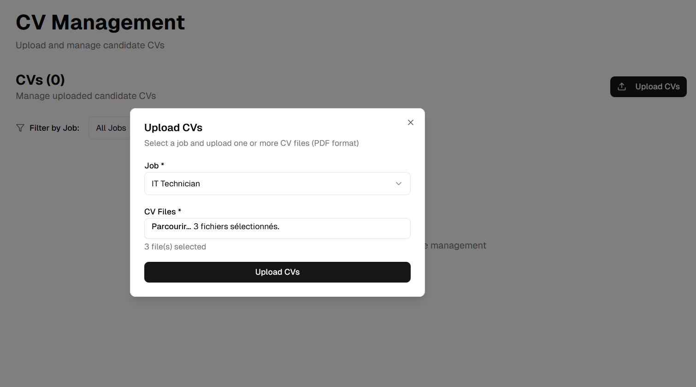
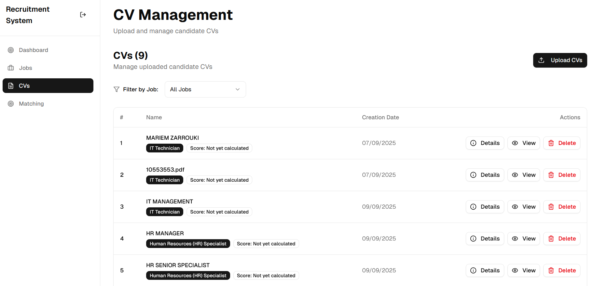
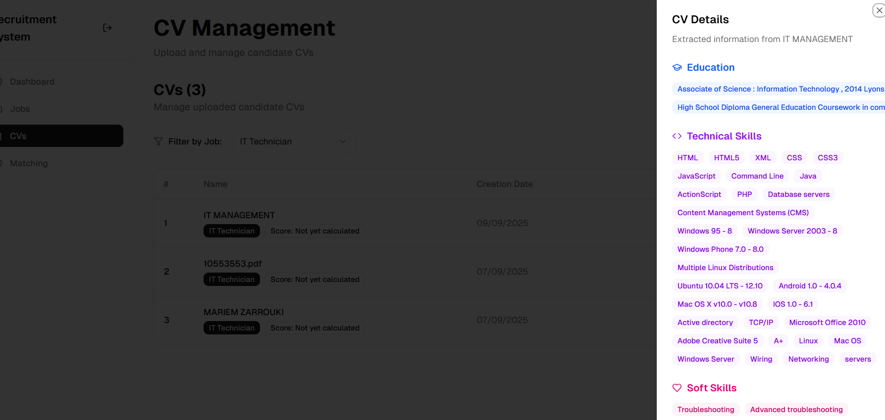
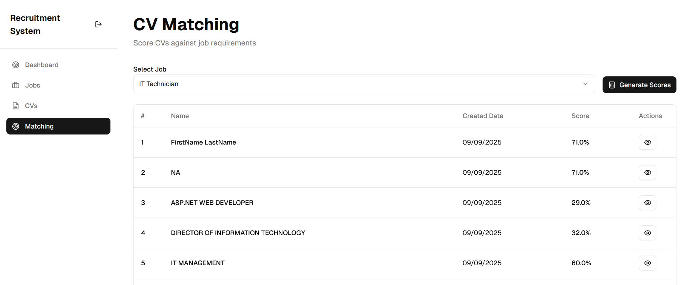
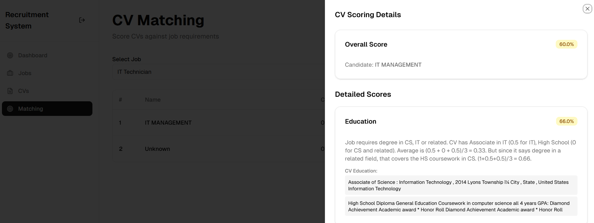
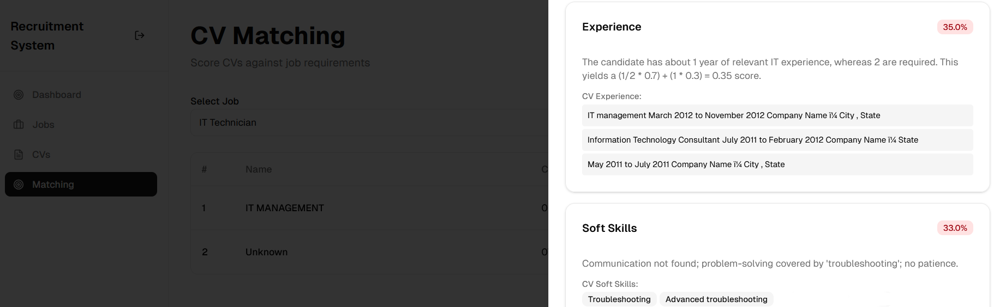
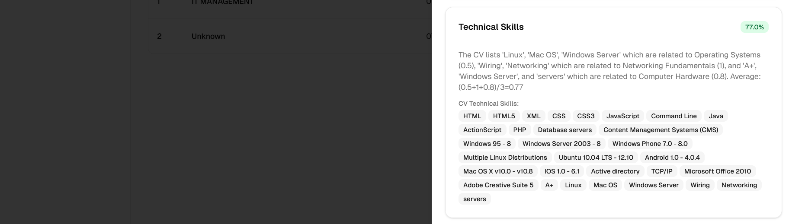
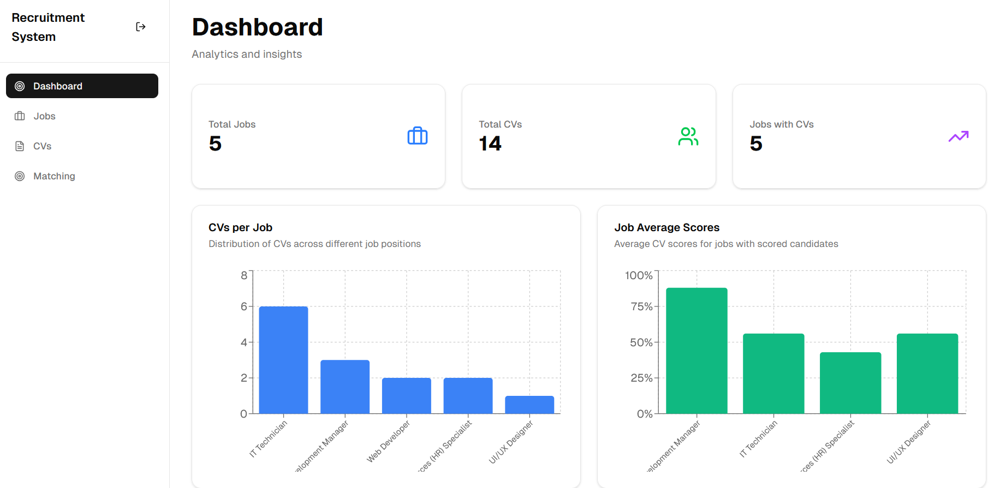
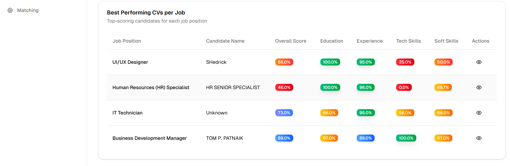

Le projet a consisté à développer une application web permettant la création et **la gestion d’offres d’emploi**, accompagnée d’une **extraction automatique des exigences** à l’aide de l’**IA (Gemini)**. Les recruteurs pouvaient ensuite importer des CVs, qui étaient analysés afin d’en **extraire les informations essentielles** telles que l’expérience professionnelle, le parcours académique, ainsi que les compétences techniques et les soft skills. Une étape de **calcul de scores** a été intégrée afin d’évaluer le **degré de correspondance entre chaque candidature et les exigences d’une offre donnée**. L’ensemble des données a été géré à l’aide de **MongoDB**, garantissant une gestion efficace et flexible des informations. Enfin, un **tableau de bord** interactif a été développé pour visualiser différents **indicateurs clés**, tels que la distribution des CVs par poste, les scores moyens des candidats ou encore l’identification des meilleurs profils pour chaque emploi.

## **Architecture logique globale :** 

## **Fonctionnalités principales**
- Gestion des offres d’emploi: ajout, mise à jour et suppression des descriptions de poste.
- Extraction automatique de l’éducation, de l’expérience, des compétences techniques et les soft skills requises à partir de l’offre.
- Gestion des CVs: importation, stockage et consultation des candidatures pour un poste.
- Extraction automatique de l’éducation, de l’expérience, des compétences techniques et les soft skills du candidat à partir du CV.
- Matching intelligent: calcul automatique d’un score de correspondance entre un CV et
 une offre d’emploi.
- Visualisation des scores de matching.
- Visualisation d'un tableau de bord contenant différents indicateurs clés 

## **Réalisations**

### **Gestion des offres d’emploi**
 La gestion des offres d’emploi constitue une composante essentielle de l’application. Elle permet aux utilisateurs (recruteurs) de créer, modifier et supprimer des annonces. Chaque offre est stockée dans la base de données MongoDB et contient des informations telles que le titre du poste, la description, le domaine d’activité et les compétences requises.

 #### Extraction automatisée des critères
 Pour optimiser le traitement des offres et éviter un travail manuel fastidieux, nous avons intégré l’API Gemini (gemini-2.0-flash). À l’aide de prompts adaptés, le modèle extrait automatiquement les principaux critères nécessaires à l’évaluation des candidatures:
 • Niveau d’éducation requis
 • Expérience professionnelle demandée
 • Compétences techniques attendues
 • Soft skills

Cette figure présente l’interface de création d’une offre de travail

Cette figure présente l’interface de la liste des offres de travail. On peut visualiser les exigences du poste, modifier une offre ou la supprimer

Ces figures présentent les exigences requises de l’offre notamment l’expérience, l’éducation, les compétences techniques et les soft skills

### **Gestion des CVs**
Le recruteur est chargé d’importer les CVs des candidats, toujours en lien avec une offre d’emploi spécifique. Les fichiers déposés sont stockés dans MongoDB, où ils sont organisés et reliés aux offres correspondantes. Le recruteur dispose également de la possibilité de consulter ou supprimer les CVs associés à une offre.

#### Extraction automatisée des critères
 Pour optimiser le traitement des offres et éviter un travail manuel fastidieux, nous avons intégré l’API Gemini (gemini-2.0-flash). À l’aide de prompts adaptés, le modèle extrait automatiquement les principaux critères nécessaires à l’évaluation des candidatures:
 • Niveau d’éducation requis
 • Expérience professionnelle demandée
 • Compétences techniques attendues
 • Soft skills

Cette figure montre l’importation de CVs en lien avec une offre d’emploi.

Cette figure montre la liste des CVs. On peut filtrer les CVs par offre de travail.

Cette figure montre les informations essentielles extraites d’un CV telles que l’éducation, l’expérience, les compétences techniques et les soft skills.

### Matching, calcul de scores et Dashboard
Le cœur du projet repose sur l’évaluation de la correspondance entre les offres et les CVs importés. Pour cela, l’application s’appuie sur l’API Gemini (gemini-2.0-flash) afin de comparer les critères extraits des offres (éducation, expérience, compétences techniques et soft skills) avec les informations extraites des CVs. Un score de matching est ainsi calculé pour chaque CV par rapport à une offre donnée. Ce score reflète le degré d’adéquation entre le profil du candidat et les exigences du poste, facilitant le travail du recruteur dans la sélection des candidatures pertinentes. En complément, l’application génère des commentaires détaillés expliquant la note attribuée à chaque critère (par exemple, pourquoi un candidat a obtenu un score élevé en compétences techniques mais faible en soft skills). Ces retours qualitatifs
offrent une meilleure compréhension du résultat numérique et aident le recruteur à justifier ses choix.

Cette figure montre l'interface calcul de scores

Ces figures montrent les scores détaillés et commentés

Ces figures montrent le dashboard 

