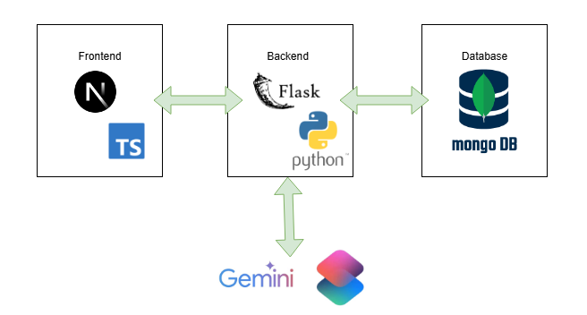
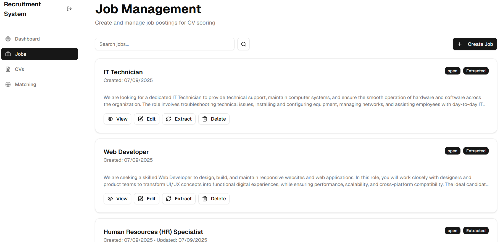
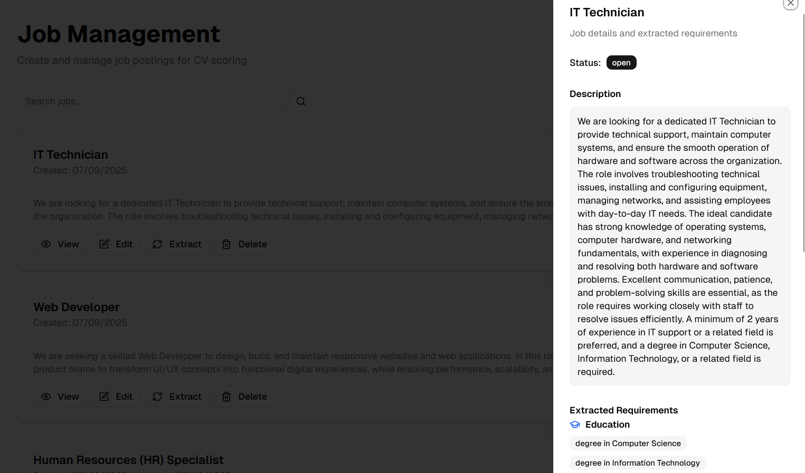
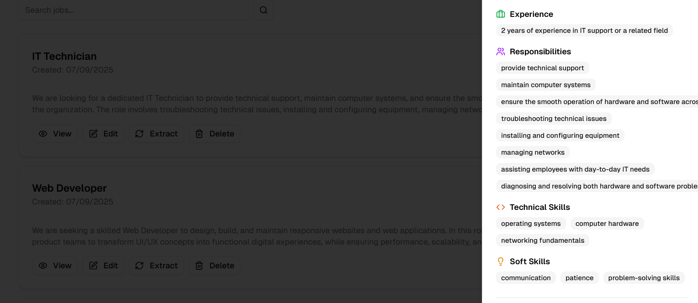

Le projet a consisté à développer une application web permettant la création et **la gestion d’offres d’emploi**, accompagnée d’une **extraction automatique des exigences** à l’aide de l’**IA (Gemini)**. Les recruteurs pouvaient ensuite importer des CVs, qui étaient analysés afin d’en **extraire les informations essentielles** telles que l’expérience professionnelle, le parcours académique, ainsi que les compétences techniques et les soft skills. Une étape de **calcul de scores** a été intégrée afin d’évaluer le **degré de correspondance entre chaque candidature et les exigences d’une offre donnée**. L’ensemble des données a été géré à l’aide de **MongoDB**, garantissant une gestion efficace et flexible des informations. Enfin, un **tableau de bord** interactif a été développé pour visualiser différents **indicateurs clés**, tels que la distribution des CVs par poste, les scores moyens des candidats ou encore l’identification des meilleurs profils pour chaque emploi.

## **Architecture logique globale :** 

## **Fonctionnalités principales**
- Gestion des offres d’emploi: ajout, mise à jour et suppression des descriptions de poste.
- Extraction automatique de l’éducation, de l’expérience, des compétences techniques et les soft skills requises à partir de l’offre.
- Gestion des CVs: importation, stockage et consultation des candidatures pour un poste.
- Extraction automatique de l’éducation, de l’expérience, des compétences techniques et les soft skills du candidat à partir du CV.
- Matching intelligent: calcul automatique d’un score de correspondance entre un CV et
 une offre d’emploi.
- Visualisation des scores de matching.
- Visualisation d'un tableau de bord contenant différents indicateurs clés 

## **Réalisations**

### **Gestion des offres d’emploi**

Cette figure présente l’interface de création d’une offre de travail

Cette figure présente l’interface de la liste des offres de travail. On peut visualiser les exigences du poste, modifier une offre ou la supprimer

Ces figures présentent les exigences requises de l’offre notamment l’expérience, l’éducation, les compétences techniques et les soft skills

### **Gestion des CVs**

